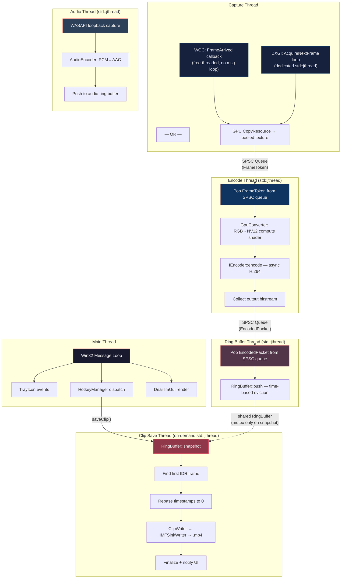

# LightRec — Architecture

> Ultra-lightweight Windows clip recorder. C++20, RAII, zero-copy GPU paths,
> lock-free queues, constant memory, < 50 MB idle RAM, < 2 % idle CPU.

---

## Table of Contents

1. [High-Level Overview](#1-high-level-overview)
2. [Folder Structure](#2-folder-structure)
3. [Class Diagram](#3-class-diagram)
4. [Thread Model](#4-thread-model)
5. [Data Flow](#5-data-flow)
6. [Component Details](#6-component-details)
7. [Memory Budget](#7-memory-budget)
8. [Error Handling & Resilience](#8-error-handling--resilience)
9. [Build & Dependencies](#9-build--dependencies)

---

## 1. High-Level Overview

LightRec runs as a system-tray application that **continuously captures** the
screen into a GPU-resident ring buffer of encoded H.264 packets.  When the user
presses a hotkey, the most recent *N* seconds are flushed to an MP4 file — 
instant replay, zero lag.

### Design Pillars

| Pillar | Approach |
|---|---|
| **Zero-copy GPU** | Capture → `ID3D11Texture2D` → GPU `CopyResource` → encoder input. Never `Map`/`Unmap`. |
| **Constant memory** | Pre-allocated texture pool + bounded `std::deque` ring buffer. No per-frame allocations. |
| **Lock-free data flow** | SPSC queues between every thread boundary. No mutexes on the hot path. |
| **RAII everywhere** | `ComPtr`, custom deleters for DLL handles, scope-guard for MF lifetime. |
| **Async encoding** | Encoder APIs are fully asynchronous; completion events / polling on dedicated threads. |

### Capture API Priority

```
1. Windows Graphics Capture  (Win10 1903+, free-threaded, per-window support)
2. DXGI Desktop Duplication   (Win8.1+, full-desktop fallback)
```

### Encoder Priority

```
1. Intel QSV   (via oneVPL — preferred per project requirements)
2. NVENC       (via NVIDIA Video Codec SDK)
3. AMD AMF     (via GPUOpen AMF SDK)
4. Software    (Media Foundation H.264 MFT — last resort)
```

---

## 2. Folder Structure

```
LightRec/
├── CMakeLists.txt                  # Top-level CMake
├── PROJECT.md
├── ARCHITECTURE.md                 # ← you are here
├── AGENTS.md
├── TASKS.md
│
├── src/
│   ├── main.cpp                    # Entry point, COM/MF init, tray loop
│   │
│   ├── core/
│   │   ├── Application.h/.cpp      # Top-level lifecycle (init → run → shutdown)
│   │   ├── Pipeline.h/.cpp         # Wires capture → encoder → ring buffer
│   │   ├── D3D11Device.h/.cpp      # RAII wrapper: ID3D11Device + context + DXGI factory
│   │   ├── GpuConverter.h/.cpp     # RGB→NV12 compute-shader converter
│   │   └── TexturePool.h/.cpp      # Pre-allocated ID3D11Texture2D pool
│   │
│   ├── capture/
│   │   ├── IFrameSource.h          # Abstract capture interface
│   │   ├── WGCCapture.h/.cpp       # Windows Graphics Capture (free-threaded)
│   │   ├── DXGICapture.h/.cpp      # DXGI Desktop Duplication fallback
│   │   └── CaptureFactory.h/.cpp   # Runtime detection & creation
│   │
│   ├── encoder/
│   │   ├── IEncoder.h              # Abstract encoder interface
│   │   ├── QSVEncoder.h/.cpp       # Intel QSV via oneVPL
│   │   ├── NVENCEncoder.h/.cpp     # NVIDIA NVENC
│   │   ├── AMFEncoder.h/.cpp       # AMD AMF
│   │   ├── MFTEncoder.h/.cpp       # Media Foundation Transform (software fallback)
│   │   └── EncoderFactory.h/.cpp   # Runtime probe & selection
│   │
│   ├── clip/
│   │   ├── EncodedPacket.h         # H.264 NAL data + timestamp + IDR flag
│   │   ├── RingBuffer.h/.cpp       # Time-bounded deque of EncodedPacket
│   │   ├── ClipWriter.h/.cpp       # Flushes ring buffer → MP4 via IMFSinkWriter
│   │   └── ClipManager.h/.cpp      # Clip save orchestration, file naming
│   │
│   ├── audio/
│   │   ├── IAudioSource.h          # Abstract audio capture interface
│   │   ├── WASAPICapture.h/.cpp    # WASAPI loopback capture
│   │   └── AudioEncoder.h/.cpp     # AAC encoding via Media Foundation
│   │
│   ├── ui/
│   │   ├── TrayIcon.h/.cpp         # System tray icon + context menu
│   │   ├── OverlayWindow.h/.cpp    # Dear ImGui settings/status overlay
│   │   └── HotkeyManager.h/.cpp    # Global hotkey registration (RegisterHotKey)
│   │
│   ├── config/
│   │   ├── Config.h/.cpp           # Settings struct + JSON serialization
│   │   └── Defaults.h              # Compile-time defaults
│   │
│   └── util/
│       ├── SPSCQueue.h             # Lock-free single-producer single-consumer queue
│       ├── ComInit.h               # RAII CoInitializeEx / MFStartup wrapper
│       ├── HRCheck.h               # HRESULT → exception helper
│       └── Log.h/.cpp              # Lightweight logger (file + debug output)
│
├── shaders/
│   └── RgbToNv12.hlsl             # Compute shader: BGRA → NV12 conversion
│
├── third_party/
│   ├── imgui/                      # Dear ImGui (submodule)
│   ├── spscqueue/                  # rigtorp/SPSCQueue (header-only)
│   └── json/                       # nlohmann/json (header-only)
│
├── tests/
│   ├── test_ring_buffer.cpp
│   ├── test_spsc_queue.cpp
│   ├── test_texture_pool.cpp
│   └── test_config.cpp
│
└── docs/
    ├── thread_model.md
    └── memory_budget.md
```

---

## 3. Class Diagram

```mermaid
classDiagram
    direction TB

    %% ──────────────── Core ────────────────
    class Application {
        -Pipeline pipeline_
        -Config config_
        -TrayIcon tray_
        -HotkeyManager hotkeys_
        +init() void
        +run() int
        +shutdown() void
    }

    class Pipeline {
        -unique_ptr~IFrameSource~ capture_
        -unique_ptr~IEncoder~ encoder_
        -RingBuffer ringBuffer_
        -ClipManager clipMgr_
        -SPSCQueue~FrameToken~ captureQueue_
        -SPSCQueue~EncodedPacket~ encodeQueue_
        -jthread captureThread_
        -jthread encodeThread_
        -jthread clipThread_
        +start() void
        +stop() void
        +saveClip() void
    }

    class D3D11Device {
        -ComPtr~ID3D11Device~ device_
        -ComPtr~ID3D11DeviceContext~ context_
        -ComPtr~IDXGIFactory2~ factory_
        +device() ID3D11Device*
        +context() ID3D11DeviceContext*
        +adapter() IDXGIAdapter*
    }

    class TexturePool {
        -vector~ComPtr~ID3D11Texture2D~~ textures_
        -SPSCQueue~uint32_t~ freeSlots_
        +acquire() PooledTexture
        +release(uint32_t slot) void
    }

    class GpuConverter {
        -ComPtr~ID3D11ComputeShader~ shader_
        +convert(src ID3D11Texture2D, dst ID3D11Texture2D) void
    }

    %% ──────────────── Capture ────────────────
    class IFrameSource {
        <<interface>>
        +start()* void
        +stop()* void
        +setCallback(fn)* void
    }

    class WGCCapture {
        -GraphicsCaptureSession session_
        -Direct3D11CaptureFramePool framePool_
        -IDirect3DDevice winrtDevice_
        +start() void
        +stop() void
        +setCallback(fn) void
    }

    class DXGICapture {
        -ComPtr~IDXGIOutputDuplication~ duplication_
        -atomic~bool~ running_
        +start() void
        +stop() void
        +setCallback(fn) void
    }

    class CaptureFactory {
        +create(D3D11Device, Config)$ unique_ptr~IFrameSource~
        +isWGCAvailable()$ bool
    }

    %% ──────────────── Encoder ────────────────
    class IEncoder {
        <<interface>>
        +init(D3D11Device, Config)* void
        +encode(ID3D11Texture2D, pts)* void
        +flush()* void
        +setOutputCallback(fn)* void
    }

    class QSVEncoder {
        -mfxSession session_
        -mfxLoader loader_
        +init(D3D11Device, Config) void
        +encode(ID3D11Texture2D, pts) void
        +flush() void
        +setOutputCallback(fn) void
    }

    class NVENCEncoder {
        -void* hEncoder_
        -HMODULE nvencLib_
        +init(D3D11Device, Config) void
        +encode(ID3D11Texture2D, pts) void
        +flush() void
        +setOutputCallback(fn) void
    }

    class AMFEncoder {
        -amf::AMFContextPtr context_
        -amf::AMFComponentPtr encoder_
        +init(D3D11Device, Config) void
        +encode(ID3D11Texture2D, pts) void
        +flush() void
        +setOutputCallback(fn) void
    }

    class MFTEncoder {
        -ComPtr~IMFTransform~ transform_
        -ComPtr~IMFDXGIDeviceManager~ dxgiMgr_
        +init(D3D11Device, Config) void
        +encode(ID3D11Texture2D, pts) void
        +flush() void
        +setOutputCallback(fn) void
    }

    class EncoderFactory {
        +create(D3D11Device, Config)$ unique_ptr~IEncoder~
        +probeGpuVendor(IDXGIAdapter)$ GpuVendor
    }

    %% ──────────────── Clip ────────────────
    class EncodedPacket {
        +vector~uint8_t~ data
        +int64_t pts
        +int64_t duration
        +bool isIDR
        +vector~uint8_t~ sps
        +vector~uint8_t~ pps
    }

    class RingBuffer {
        -deque~EncodedPacket~ packets_
        -chrono::seconds maxDuration_
        -mutex mutex_
        +push(EncodedPacket) void
        +snapshot() vector~EncodedPacket~
        +clear() void
        +memoryUsage() size_t
    }

    class ClipWriter {
        -ComPtr~IMFSinkWriter~ sinkWriter_
        +open(path) void
        +writePackets(span~EncodedPacket~) void
        +finalize() void
    }

    class ClipManager {
        -RingBuffer* ringBuffer_
        -Config* config_
        -jthread saveThread_
        +requestSave() void
    }

    %% ──────────────── Audio ────────────────
    class IAudioSource {
        <<interface>>
        +start()* void
        +stop()* void
        +setCallback(fn)* void
    }

    class WASAPICapture {
        -ComPtr~IAudioClient~ client_
        -ComPtr~IAudioCaptureClient~ captureClient_
        +start() void
        +stop() void
        +setCallback(fn) void
    }

    class AudioEncoder {
        -ComPtr~IMFTransform~ transform_
        +encode(span~float~) vector~uint8_t~
    }

    %% ──────────────── UI ────────────────
    class TrayIcon {
        -NOTIFYICONDATAW nid_
        -HWND hwnd_
        +show() void
        +hide() void
        +setStatus(RecordingState) void
    }

    class HotkeyManager {
        -map~int,function~ handlers_
        +registerHotkey(vk, mod, fn) void
        +unregisterAll() void
        +processMessage(MSG) bool
    }

    class OverlayWindow {
        -HWND hwnd_
        -ComPtr~ID3D11Device~ device_
        +show() void
        +hide() void
        +render() void
    }

    %% ──────────────── Config ────────────────
    class Config {
        +uint32_t clipDurationSec
        +uint32_t bitrateMbps
        +uint32_t fps
        +EncoderType preferredEncoder
        +filesystem::path outputDir
        +HotkeyBinding clipHotkey
        +load(path) void
        +save(path) void
    }

    %% ──────────────── Util ────────────────
    class SPSCQueue~T~ {
        -alignas(64) atomic~size_t~ head_
        -alignas(64) atomic~size_t~ tail_
        -unique_ptr~T[]~ buffer_
        +try_push(T) bool
        +try_pop(T&) bool
    }

    %% ──────────────── Relationships ────────────────
    Application --> Pipeline
    Application --> Config
    Application --> TrayIcon
    Application --> HotkeyManager
    Application --> OverlayWindow

    Pipeline --> IFrameSource
    Pipeline --> IEncoder
    Pipeline --> RingBuffer
    Pipeline --> ClipManager
    Pipeline --> TexturePool
    Pipeline --> GpuConverter
    Pipeline --> D3D11Device
    Pipeline --> SPSCQueue

    IFrameSource <|.. WGCCapture
    IFrameSource <|.. DXGICapture
    CaptureFactory ..> IFrameSource : creates

    IEncoder <|.. QSVEncoder
    IEncoder <|.. NVENCEncoder
    IEncoder <|.. AMFEncoder
    IEncoder <|.. MFTEncoder
    EncoderFactory ..> IEncoder : creates

    RingBuffer o-- EncodedPacket
    ClipManager --> RingBuffer
    ClipManager --> ClipWriter
    ClipWriter --> EncodedPacket

    IAudioSource <|.. WASAPICapture
    Pipeline --> IAudioSource
    Pipeline --> AudioEncoder
```



---

## 4. Thread Model



### Thread Inventory

| # | Thread | Lifetime | Mechanism | Hot Path? |
|---|--------|----------|-----------|-----------|
| 1 | **Main** | App lifetime | Win32 `GetMessage` loop | No |
| 2 | **Capture** | Recording active | WGC internal pool thread / `std::jthread` for DXGI | **Yes** |
| 3 | **Encode** | Recording active | `std::jthread`, spins on SPSC queue | **Yes** |
| 4 | **RingBuffer** | Recording active | `std::jthread`, spins on SPSC queue | **Yes** |
| 5 | **Audio** | Recording active | `std::jthread`, WASAPI event-driven | Medium |
| 6 | **ClipSave** | On-demand | `std::jthread`, spawned per save request | No |

### Synchronization Rules

- **Hot-path threads (2→3→4)**: communicate **only** via `SPSCQueue`. Zero mutexes.
- **RingBuffer**: internal `std::mutex` protects `snapshot()` only (cold path, clip save).
  `push()` from thread 4 is the single writer and is always lock-free in practice
  because `snapshot()` holds the lock very briefly (memcpy of a `deque` span).
- **TexturePool**: lock-free via SPSC of free slot indices.
- **Config**: read-only after init; atomic flags for runtime toggles.
- **UI→Pipeline**: one-shot `std::atomic<bool>` flags or `std::latch` for commands.

### Why `std::jthread`?

- C++20 cooperative cancellation via `std::stop_token` — clean shutdown without
  raw `std::atomic<bool>` flags.
- RAII: thread joins automatically in destructor, no leaked threads.

---

## 5. Data Flow

```mermaid
flowchart LR
    subgraph CAPTURE ["① Capture (GPU)"]
        direction TB
        Screen["🖥️ Screen / Window"]
        WGC["WGCCapture<br/>FrameArrived"]
        DXGI["DXGICapture<br/>AcquireNextFrame"]
        Screen --> WGC
        Screen -.-> DXGI
    end

    subgraph TEXPOOL ["② Texture Pool"]
        Pool["TexturePool<br/>(pre-allocated)"]
    end

    subgraph ENCODE ["③ Encode (GPU)"]
        direction TB
        Copy["GPU CopyResource<br/>(VRAM → VRAM)"]
        Convert["GpuConverter<br/>BGRA→NV12<br/>(compute shader)"]
        Enc["IEncoder::encode<br/>(QSV / NVENC / AMF)"]
        Copy --> Convert --> Enc
    end

    subgraph RING ["④ Ring Buffer (CPU)"]
        direction TB
        RB["RingBuffer<br/>≤30s encoded H.264<br/>~30 MB @ 8 Mbps"]
        Evict["Time-based eviction<br/>(drop oldest packets)"]
        RB --> Evict
    end

    subgraph CLIPSAVE ["⑤ Clip Save (Disk)"]
        direction TB
        Snap["snapshot()"]
        IDR["Find first IDR"]
        Mux["ClipWriter<br/>IMFSinkWriter"]
        MP4["📁 output.mp4"]
        Snap --> IDR --> Mux --> MP4
    end

    subgraph AUDIO ["⑥ Audio"]
        direction TB
        Mic["🎤 WASAPI Loopback"]
        AAC["AudioEncoder<br/>PCM→AAC"]
        ARB["Audio Ring Buffer"]
        Mic --> AAC --> ARB
    end

    WGC -- "ID3D11Texture2D" --> Pool
    DXGI -- "ID3D11Texture2D" --> Pool
    Pool -- "SPSC Queue<br/>(FrameToken)" --> Copy
    Enc -- "SPSC Queue<br/>(EncodedPacket)" --> RB
    RB -. "on hotkey" .-> Snap
    ARB -. "muxed into" .-> Mux

    style Screen fill:#0d1117,stroke:#58a6ff,color:#c9d1d9
    style WGC fill:#161b22,stroke:#3fb950,color:#c9d1d9
    style DXGI fill:#161b22,stroke:#d29922,color:#c9d1d9
    style Pool fill:#161b22,stroke:#bc8cff,color:#c9d1d9
    style Copy fill:#161b22,stroke:#58a6ff,color:#c9d1d9
    style Convert fill:#161b22,stroke:#58a6ff,color:#c9d1d9
    style Enc fill:#161b22,stroke:#f778ba,color:#c9d1d9
    style RB fill:#161b22,stroke:#3fb950,color:#c9d1d9
    style Mux fill:#161b22,stroke:#d29922,color:#c9d1d9
    style MP4 fill:#0d1117,stroke:#3fb950,color:#c9d1d9
```



### FrameToken

The token passed through the capture→encode SPSC queue:

```cpp
struct FrameToken {
    uint32_t         textureSlot;   // index into TexturePool
    int64_t          pts;           // QueryPerformanceCounter timestamp
    D3D11_TEXTURE2D_DESC desc;      // width, height, format
};
```

The encoder thread uses `textureSlot` to look up the `ID3D11Texture2D` in the
pool, performs GPU copy + color convert + encode, then **returns the slot** to
the pool's free list.

### EncodedPacket

```cpp
struct EncodedPacket {
    std::vector<uint8_t>  data;       // H.264 NAL unit(s), AVCC format
    int64_t               pts;        // presentation time (100ns units)
    int64_t               duration;   // frame duration (100ns units)
    bool                  isIDR;      // keyframe flag
    std::vector<uint8_t>  sps;        // SPS NAL (present only on IDR)
    std::vector<uint8_t>  pps;        // PPS NAL (present only on IDR)
};
```

### Zero-Copy Guarantee

```
┌─────────────────────────────────────────────────────┐
│                    GPU  (VRAM)                       │
│                                                     │
│  Capture Texture ──CopyResource──▶ Pool Texture     │
│                                       │             │
│                              Compute Shader         │
│                              (BGRA → NV12)          │
│                                       │             │
│                                       ▼             │
│                              Encoder Input Surface  │
│                              (QSV / NVENC / AMF)    │
│                                       │             │
│                                 HW Encode           │
│                                       │             │
└───────────────────────────────────────│─────────────┘
                                        ▼
                              Encoded bitstream (CPU)
                              → Ring Buffer
```

**No CPU readback** occurs at any point.  The only CPU-resident data is the
final encoded H.264 bitstream (~1 MB/s at 8 Mbps), which feeds the ring buffer.

---

## 6. Component Details

### 6.1 Capture — `IFrameSource`

```cpp
// capture/IFrameSource.h
class IFrameSource {
public:
    using FrameCallback = std::function<void(ID3D11Texture2D*, int64_t pts)>;

    virtual ~IFrameSource() = default;
    virtual void start() = 0;
    virtual void stop()  = 0;
    virtual void setCallback(FrameCallback cb) = 0;
};
```

#### WGCCapture

- Uses `Direct3D11CaptureFramePool::CreateFreeThreaded()` — **no message loop
  required**, callbacks fire on an internal WinRT thread.
- Buffer count = 2 (double-buffered). Dropped frames are acceptable (newest
  wins) — we don't need every frame, just the latest for encoding.
- Runtime detection:
  ```cpp
  bool isAvailable =
      winrt::ApiInformation::IsTypePresent(
          L"Windows.Graphics.Capture.GraphicsCaptureItem") &&
      winrt::GraphicsCaptureSession::IsSupported();
  ```

#### DXGICapture

- Fallback for Win8.1+ or when WGC is unavailable.
- Uses `IDXGIOutput5::DuplicateOutput1()` (preferred over `DuplicateOutput`
  for HDR display compatibility).
- Runs a dedicated `std::jthread` with `AcquireNextFrame(16ms timeout)` loop.
- Must handle `DXGI_ERROR_ACCESS_LOST` by recreating the duplication object
  (monitor mode change, UAC dialog, etc.).
- Requires `SetProcessDpiAwarenessContext(DPI_AWARENESS_CONTEXT_PER_MONITOR_AWARE_V2)`.

#### CaptureFactory

```cpp
std::unique_ptr<IFrameSource> CaptureFactory::create(
    D3D11Device& device, const Config& config)
{
    if (CaptureFactory::isWGCAvailable())
        return std::make_unique<WGCCapture>(device, config);
    return std::make_unique<DXGICapture>(device, config);
}
```

---

### 6.2 Encoder — `IEncoder`

```cpp
// encoder/IEncoder.h
class IEncoder {
public:
    using OutputCallback = std::function<void(EncodedPacket)>;

    virtual ~IEncoder() = default;
    virtual void init(D3D11Device& device, const Config& config) = 0;
    virtual void encode(ID3D11Texture2D* texture, int64_t pts)   = 0;
    virtual void flush()                                          = 0;
    virtual void setOutputCallback(OutputCallback cb)             = 0;
};
```

#### QSVEncoder (Preferred)

- Uses **oneVPL** (oneAPI Video Processing Library) — modern replacement for
  Intel Media SDK.
- Binds D3D11 device via `MFXVideoCORE_SetHandle(MFX_HANDLE_D3D11_DEVICE, …)`.
- Zero-copy input via `MFX_SURFACE_FLAG_IMPORT_SHARED` (oneVPL 2.10+).
- Async: `MFXVideoENCODE_EncodeFrameAsync()` with sync-point completion.
- IDR interval: 1–2 seconds for clean clip boundaries.

#### NVENCEncoder

- Loads `nvEncodeAPI64.dll` at runtime; fails gracefully if absent.
- Registers `ID3D11Texture2D` via `nvEncRegisterResource()`.
- True async: `enableEncodeAsync = 1`, Windows Event completion objects.
- Supports `NV_ENC_BUFFER_FORMAT_ARGB` — can skip RGB→NV12 conversion if
  NVENC handles it internally (GPU-side CSC).

#### AMFEncoder

- Loads `amfrt64.dll` at runtime.
- `AMFContext::InitDX11(pDevice)` shares the D3D11 device.
- `CreateSurfaceFromDX11Native()` for zero-copy input.
- Async: `SubmitInput()` non-blocking, `QueryOutput()` polled from encode thread.

#### MFTEncoder (Software Fallback)

- Uses `MFTEnumEx` with `MFT_ENUM_FLAG_HARDWARE` first, then software.
- D3D11-aware via `IMFDXGIDeviceManager`.
- Async MFT event model: `METransformNeedInput` / `METransformHaveOutput`.

#### EncoderFactory — Detection Strategy

```cpp
GpuVendor vendor = EncoderFactory::probeGpuVendor(device.adapter());
//   0x8086 → Intel  → try QSVEncoder
//   0x10DE → NVIDIA → try NVENCEncoder
//   0x1002 → AMD    → try AMFEncoder

// Preferred order (per project requirements):
// 1. QSV  2. NVENC  3. AMF  4. MFT (software)
```

---

### 6.3 Clip — Ring Buffer & Save

#### RingBuffer

- Stores `EncodedPacket` objects in a `std::deque`.
- Time-based eviction: after every `push()`, drops packets older than
  `maxDuration + 1 GOP` from the front.
- `snapshot()` returns a copy of all packets under a brief `std::mutex` lock
  (cold path only, triggered by hotkey).

#### IDR / GOP Considerations

- **GOP size = 1–2 seconds** (encoder configured at init).
- Ring buffer capacity = `clipDuration + 1 GOP` to guarantee at least one IDR
  at the start of any clip.
- SPS/PPS NALs are stored alongside each IDR packet for self-contained clip
  muxing.

#### ClipWriter — MP4 Output

- Creates `IMFSinkWriter` with `MFCreateSinkWriterFromURL(L"…/clip.mp4", …)`.
- Writes H.264 in **AVCC format** (length-prefixed NALs, not Annex B).
- Sets `MF_MT_MPEG_SEQUENCE_HEADER` from the first IDR's SPS/PPS.
- Rebases all timestamps so the clip starts at PTS = 0.
- Audio track interleaved from the audio ring buffer.
- `Finalize()` writes the `moov` atom; called in RAII destructor.

#### ClipManager

- Receives save requests from `HotkeyManager` via atomic flag.
- Spawns a `std::jthread` per save (or queues if one is in progress).
- Generates timestamped filenames: `LightRec_2025-01-15_14-30-22.mp4`.
- Notifies UI on completion (toast / overlay flash).

---

### 6.4 Audio — WASAPI + AAC

- **WASAPICapture**: loopback mode captures system audio via
  `IAudioClient::Initialize(AUDCLNT_SHAREMODE_SHARED, AUDCLNT_STREAMFLAGS_LOOPBACK, …)`.
  Event-driven (WASAPI signals an event when a buffer is ready).
- **AudioEncoder**: wraps Media Foundation's AAC MFT for encoding float PCM →
  AAC-LC.
- Audio packets stored in a separate ring buffer, time-aligned with video via
  shared QPC timestamps.
- Muxed into the MP4 as a second stream during clip save.

---

### 6.5 UI — Dear ImGui + System Tray

#### TrayIcon

- `Shell_NotifyIconW` with `NOTIFYICONDATAW`.
- Context menu: Start/Stop, Save Clip, Settings, Exit.
- Balloon notifications for clip saved / errors.

#### OverlayWindow

- Transparent, always-on-top `WS_EX_LAYERED` window.
- Dear ImGui rendered via D3D11 (shares the same `ID3D11Device`).
- Shows: recording status, FPS, memory usage, last clip path.
- Toggled via hotkey or tray menu.

#### HotkeyManager

- `RegisterHotKey(hwnd, id, MOD_*, VK_*)` for global hotkeys.
- Default: `Ctrl+Shift+F10` = save clip.
- Dispatches `WM_HOTKEY` messages from the Win32 message loop.

---

### 6.6 Core — D3D11Device

```cpp
class D3D11Device {
    ComPtr<ID3D11Device>        device_;
    ComPtr<ID3D11DeviceContext>  context_;
    ComPtr<IDXGIAdapter>        adapter_;
    ComPtr<IDXGIFactory2>       factory_;

public:
    D3D11Device() {
        // Create on the adapter that drives the primary display
        // CRITICAL: must match the display adapter for zero-copy WGC
        ComPtr<IDXGIFactory2> factory;
        CreateDXGIFactory2(0, IID_PPV_ARGS(&factory));
        factory->EnumAdapters(0, &adapter_);
        D3D11CreateDevice(
            adapter_.Get(),
            D3D_DRIVER_TYPE_UNKNOWN,
            nullptr,
            D3D11_CREATE_DEVICE_BGRA_SUPPORT,
            featureLevels, _countof(featureLevels),
            D3D11_SDK_VERSION,
            &device_, nullptr, &context_);
        factory_ = factory;
    }
};
```

> **Multi-GPU warning**: On laptops with Intel iGPU + discrete GPU, the D3D11
> device **must** be created on the same adapter that drives the target display.
> Otherwise WGC/DXGI forces a cross-GPU copy, negating zero-copy benefits.

---

### 6.7 Util — SPSCQueue

Lock-free, cache-line-padded, power-of-two-sized:

```cpp
template <typename T>
class SPSCQueue {
    alignas(64) std::atomic<size_t> head_{0};
    alignas(64) std::atomic<size_t> tail_{0};
    std::unique_ptr<T[]>            buffer_;
    size_t                          mask_;  // capacity - 1

public:
    explicit SPSCQueue(size_t capacity)
        : buffer_(std::make_unique<T[]>(capacity))
        , mask_(capacity - 1)
    {
        assert((capacity & (capacity - 1)) == 0); // power of two
    }

    bool try_push(T value) {
        auto h = head_.load(std::memory_order_relaxed);
        auto next = (h + 1) & mask_;
        if (next == tail_.load(std::memory_order_acquire)) return false;
        buffer_[h] = std::move(value);
        head_.store(next, std::memory_order_release);
        return true;
    }

    bool try_pop(T& value) {
        auto t = tail_.load(std::memory_order_relaxed);
        if (t == head_.load(std::memory_order_acquire)) return false;
        value = std::move(buffer_[t]);
        tail_.store((t + 1) & mask_, std::memory_order_release);
        return true;
    }
};
```

---

## 7. Memory Budget

| Component | Allocation | Size | Lifetime |
|---|---|---|---|
| D3D11 Device + context | GPU | ~2 MB | App |
| TexturePool (4× 1080p BGRA) | VRAM | ~32 MB VRAM | Recording |
| NV12 staging textures (2×) | VRAM | ~8 MB VRAM | Recording |
| Capture SPSC queue (8 slots) | CPU | ~256 B | Recording |
| Encode SPSC queue (16 slots) | CPU | ~1 KB | Recording |
| Ring buffer (30s @ 8 Mbps) | CPU | **~30 MB** | Recording |
| Audio ring buffer (30s AAC) | CPU | ~1 MB | Recording |
| Dear ImGui context | CPU | ~2 MB | App |
| Config + misc | CPU | ~1 MB | App |
| **Total CPU RAM** | | **~35 MB** | |
| **Total VRAM** | | **~40 MB** | |

✅ Well within the **50 MB idle RAM** target.  During clip save, a temporary
snapshot copy adds ~30 MB for the duration of the write (~1–2 seconds).

---

## 8. Error Handling & Resilience

| Failure | Recovery |
|---|---|
| WGC unavailable | Fall back to DXGI Desktop Duplication |
| QSV init fails | Try NVENC → AMF → MFT (software) |
| `DXGI_ERROR_ACCESS_LOST` | Recreate duplication object, resume capture |
| Encoder returns busy | Retry with backoff; drop frame after 3 retries |
| Disk full on clip save | Notify user via tray balloon; abort save |
| GPU device lost (`DXGI_ERROR_DEVICE_REMOVED`) | Full pipeline restart |
| Ring buffer OOM | Bounded by `maxDuration`; eviction prevents growth |

All COM/HRESULT errors are checked via a `ThrowIfFailed(hr, context)` helper
that throws `std::system_error` with the HRESULT code.

---

## 9. Build & Dependencies

### CMake Structure

```cmake
cmake_minimum_required(VERSION 3.24)
project(LightRec LANGUAGES CXX)

set(CMAKE_CXX_STANDARD 20)
set(CMAKE_CXX_STANDARD_REQUIRED ON)

# Windows SDK (D3D11, DXGI, WGC, MF, WASAPI)
# Linked automatically via #pragma comment(lib, …) or target_link_libraries

# Third-party
add_subdirectory(third_party/imgui)

# Main executable
add_executable(LightRec WIN32
    src/main.cpp
    src/core/Application.cpp
    src/core/Pipeline.cpp
    src/core/D3D11Device.cpp
    src/core/GpuConverter.cpp
    src/core/TexturePool.cpp
    src/capture/WGCCapture.cpp
    src/capture/DXGICapture.cpp
    src/capture/CaptureFactory.cpp
    src/encoder/QSVEncoder.cpp
    src/encoder/NVENCEncoder.cpp
    src/encoder/AMFEncoder.cpp
    src/encoder/MFTEncoder.cpp
    src/encoder/EncoderFactory.cpp
    src/clip/RingBuffer.cpp
    src/clip/ClipWriter.cpp
    src/clip/ClipManager.cpp
    src/audio/WASAPICapture.cpp
    src/audio/AudioEncoder.cpp
    src/ui/TrayIcon.cpp
    src/ui/OverlayWindow.cpp
    src/ui/HotkeyManager.cpp
    src/config/Config.cpp
    src/util/Log.cpp
)

target_link_libraries(LightRec PRIVATE
    d3d11 dxgi d3dcompiler
    mf mfplat mfreadwrite mfuuid
    windowsapp              # WinRT / WGC
    shell32                 # tray icon
    imgui
)

target_include_directories(LightRec PRIVATE
    src
    third_party/imgui
    third_party/spscqueue
    third_party/json/include
)
```

### Third-Party Libraries (Header-Only / Submodules)

| Library | Purpose | Type |
|---|---|---|
| [Dear ImGui](https://github.com/ocornut/imgui) | Overlay UI | Submodule |
| [rigtorp/SPSCQueue](https://github.com/rigtorp/SPSCQueue) | Lock-free queue reference | Header-only |
| [nlohmann/json](https://github.com/nlohmann/json) | Config serialization | Header-only |

### SDK Dependencies (Runtime, Loaded Dynamically)

| SDK | DLL | When |
|---|---|---|
| oneVPL | `libvpl.dll` | QSV encoder init |
| NVENC | `nvEncodeAPI64.dll` | NVENC encoder init |
| AMF | `amfrt64.dll` | AMF encoder init |

These are loaded with `LoadLibraryW()` and probed at runtime. LightRec has
**zero hard dependencies** on vendor SDKs — it compiles and runs without any
of them installed, falling back gracefully.
