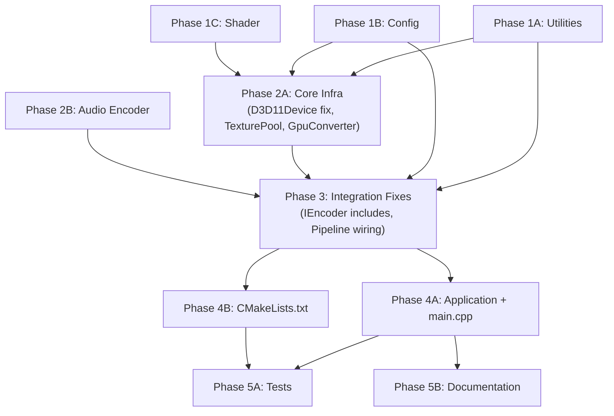

# LightRec — Agent Prompts for Project Completion

> **How to use:** Execute these prompts **in phase order**. Agents within the same phase have no dependencies on each other and can run in parallel. Each prompt is self-contained — copy-paste it to an agent conversation.

---

## Dependency Graph



---

## Phase 1 — Foundation (No Dependencies, Run in Parallel)

---

### 🔧 Agent 1: Utilities (`src/util/`)

```
TASK: Create the utility library for LightRec under src/util/

PROJECT CONTEXT:
LightRec is an ultra-lightweight Windows screen recorder in C++20.
The src/util/ directory does NOT exist yet. Multiple existing components
reference these utilities but they haven't been created.

CODING RULES (from AGENTS.md):
- C++20, RAII everywhere, lock-free queues
- No blocking operations, no large allocations during gameplay
- Idle RAM < 50 MB, Idle CPU < 2%

CREATE THESE FILES:

1. src/util/SPSCQueue.h
   - Lock-free single-producer single-consumer queue
   - Template class: SPSCQueue<T>
   - Cache-line-padded (alignas(64)) atomic head/tail
   - Power-of-two capacity enforced via assert
   - Methods: try_push(T value) -> bool, try_pop(T& value) -> bool
   - Use std::memory_order_relaxed for local loads,
     std::memory_order_acquire for cross-thread reads,
     std::memory_order_release for cross-thread writes
   - Header-only
   NOTE: src/audio/AudioRingBuffer.h already has a lock-free ring buffer
   for raw audio bytes. SPSCQueue is for typed objects (FrameToken,
   EncodedPacket). Do NOT merge them — they serve different purposes.

2. src/util/ComInit.h
   - RAII wrapper for COM and Media Foundation initialization
   - Constructor calls CoInitializeEx(nullptr, COINIT_MULTITHREADED)
     and MFStartup(MF_VERSION, MFSTARTUP_NOSOCKET)
   - Destructor calls MFShutdown() and CoUninitialize()
   - Non-copyable, non-movable
   - Header-only
   - Include <combaseapi.h>, <mfapi.h>

3. src/util/HRCheck.h
   - Helper to convert HRESULT failures to exceptions
   - Function: ThrowIfFailed(HRESULT hr, const char* context = nullptr)
   - Throws std::system_error with std::system_category() on failure
   - NOTE: src/capture/CaptureCommon.h already defines a ThrowIfFailed
     in namespace lightrec::capture. Your version should be in
     namespace lightrec::util or the global lightrec namespace.
     Do NOT create a conflict — check if CaptureCommon's version can
     be reused or ensure different namespaces.
   - Header-only

4. src/util/Log.h + src/util/Log.cpp
   - Lightweight logger with file + OutputDebugStringW output
   - Log levels: Trace, Debug, Info, Warn, Error
   - Global singleton or free functions: LogInfo(...), LogError(...), etc.
   - Use std::format (C++20) for formatting
   - Thread-safe (consider using a lock-free approach or simple mutex
     since logging is not on the hot path)
   - Log to both a file (LightRec.log in the output directory) and
     OutputDebugStringW for debugger output
   - Keep it minimal — this is a utility, not a framework

ACCEPTANCE CRITERIA:
- All files compile with MSVC /std:c++20
- SPSCQueue passes basic push/pop/full/empty tests
- ComInit properly initializes and tears down COM+MF
- No external dependencies beyond Windows SDK
```

---

### ⚙️ Agent 2: Config (`src/config/`)

```
TASK: Create the configuration system for LightRec under src/config/

PROJECT CONTEXT:
LightRec is an ultra-lightweight Windows screen recorder in C++20.
The src/config/ directory does NOT exist yet, but it is referenced by:
- src/encoder/IEncoder.h line 8: #include "../config/Config.h" (BROKEN)
- Multiple components expect a Config struct with encoder/capture settings

EXISTING RELATED CODE:
- src/ui/UIConfig.h already defines a settings struct with load/save
  using the Windows Registry. Read it first to understand the pattern.
  Path: src/ui/UIConfig.h and src/ui/UIConfig.cpp
- The architecture specifies JSON serialization via nlohmann/json
  (available at third_party/json/include/nlohmann/json.hpp)

CODING RULES:
- C++20, RAII
- Config is read-only after init; atomic flags for runtime toggles

CREATE THESE FILES:

1. src/config/Defaults.h
   - Compile-time constants:
     - kDefaultClipDurationSec = 30
     - kDefaultBitrateMbps = 8
     - kDefaultFps = 60
     - kDefaultOutputDir = L"" (empty = use Videos/LightRec/)
     - kDefaultClipHotkey = VK_F10
     - kDefaultClipHotkeyMod = MOD_CONTROL | MOD_SHIFT
     - kDefaultEncoderPreference = Auto (detect GPU vendor)
   - Use constexpr

2. src/config/Config.h + src/config/Config.cpp
   - Struct Config with fields:
     - uint32_t clipDurationSec
     - uint32_t bitrateMbps
     - uint32_t fps
     - EncoderType preferredEncoder (enum: Auto, QSV, NVENC, AMF, Software)
     - std::filesystem::path outputDir
     - uint32_t clipHotkeyVk
     - uint32_t clipHotkeyMod
     - bool replayEnabled
     - float systemVolume (0.0-1.0)
     - float micVolume (0.0-1.0)
     - bool micEnabled
   - Methods:
     - static Config load(const std::filesystem::path& path)
       — loads from JSON file, falls back to defaults if file missing
     - void save(const std::filesystem::path& path) const
       — writes JSON file
     - static Config defaults()
       — returns a Config with all default values
     - static std::filesystem::path defaultConfigPath()
       — returns %APPDATA%/LightRec/config.json
     - static std::filesystem::path defaultOutputDir()
       — returns %USERPROFILE%/Videos/LightRec/
   - Use nlohmann/json for serialization
     Include path: #include <nlohmann/json.hpp>
   - IMPORTANT: The EncoderType enum must be compatible with what
     src/encoder/EncoderFactory.cpp expects. Read that file to
     understand how encoder selection works — it currently uses
     GPU vendor probing. Your Config should allow overriding this.

ACCEPTANCE CRITERIA:
- Config::load() works with a valid JSON file
- Config::load() returns defaults when file is missing
- Config::save() writes valid JSON
- Compiles with MSVC /std:c++20
- After this, src/encoder/IEncoder.h's #include "../config/Config.h"
  must resolve correctly
```

---

### 🎨 Agent 3: GPU Shader (`shaders/`)

```
TASK: Create the BGRA-to-NV12 compute shader for LightRec.

PROJECT CONTEXT:
LightRec captures screen frames as BGRA8 textures (from WGC/DXGI) but
H.264 encoders require NV12 format. This compute shader performs the
color space conversion entirely on the GPU (zero CPU involvement).

The shaders/ directory does NOT exist yet.

CREATE THIS FILE:

1. shaders/RgbToNv12.hlsl
   - HLSL Compute Shader (cs_5_0)
   - Input: Texture2D<float4> inputTex (BGRA8_UNORM, bound as SRV)
   - Output: Two UAVs:
     - RWTexture2D<float> lumaOut (R8_UNORM, full resolution)
     - RWTexture2D<float2> chromaOut (R8G8_UNORM, half resolution)
   - Thread group size: [numthreads(16, 16, 1)]
   - Each thread processes one pixel for luma (Y)
   - Threads at even (x,y) coordinates also compute chroma (UV)
     by averaging a 2x2 block
   - Color conversion formula (BT.709):
     Y  =  0.2126 * R + 0.7152 * G + 0.0722 * B
     Cb = -0.1146 * R - 0.3854 * G + 0.5000 * B + 0.5
     Cr =  0.5000 * R - 0.4542 * G - 0.0458 * B + 0.5
   - Use a cbuffer for texture dimensions:
     cbuffer Params : register(b0) {
         uint Width;
         uint Height;
     };
   - Clamp output to [0, 1] range
   - Handle edge cases: when dispatch covers pixels beyond
     texture dimensions, early-return

ACCEPTANCE CRITERIA:
- Valid HLSL that compiles with fxc.exe or dxc.exe targeting cs_5_0
- Correct BT.709 color matrix
- Chroma subsampling (4:2:0) with 2x2 block averaging
- No unnecessary memory barriers (compute shader with independent pixels)
```

---

## Phase 2 — Core Infrastructure (Depends on Phase 1)

---

### 🖥️ Agent 4: Core Infrastructure (`src/core/` additions + fixes)

```
TASK: Fix D3D11Device and create TexturePool + GpuConverter in src/core/

PROJECT CONTEXT:
LightRec is a C++20 Windows screen recorder. The core/ directory has:
- Pipeline.h/.cpp (EXISTS, ~1.5KB each — wires capture→encoder→ringbuffer)
- D3D11Device.h (EXISTS but BROKEN — stub with wrong method names)

CRITICAL ISSUES TO FIX:

1. src/core/D3D11Device.h has methods getDevice()/getContext() but:
   - src/encoder/NVENCEncoder.cpp calls device.device() and device.adapter()
   - src/encoder/QSVEncoder.cpp likely calls similar methods
   - src/capture/CaptureFactory.cpp passes D3D11Device to captures
   Read ALL encoder .cpp files and capture .cpp files first to determine
   the EXACT method signatures they expect on D3D11Device, then fix
   D3D11Device to match.

FILES TO MODIFY:

1. src/core/D3D11Device.h → REWRITE to full implementation
   - RAII wrapper for ID3D11Device + ID3D11DeviceContext + IDXGIAdapter
   - Constructor creates D3D11 device on the primary display adapter:
     - CreateDXGIFactory2() → EnumAdapters(0) → D3D11CreateDevice()
     - D3D_DRIVER_TYPE_UNKNOWN (since we specify an adapter)
     - D3D11_CREATE_DEVICE_BGRA_SUPPORT flag
     - Feature level 11_0 minimum
   - Methods (match what existing code expects):
     - device() → ID3D11Device*
     - context() → ID3D11DeviceContext*
     - adapter() → IDXGIAdapter*
     - factory() → IDXGIFactory2* (if needed)
   - Use Microsoft::WRL::ComPtr for all COM pointers
   - Store adapter_ so it can be queried for GPU vendor ID

FILES TO CREATE:

2. src/core/TexturePool.h + src/core/TexturePool.cpp
   - Pre-allocates a fixed number of ID3D11Texture2D objects
   - Constructor: TexturePool(ID3D11Device*, uint32_t width,
     uint32_t height, DXGI_FORMAT format, uint32_t count)
   - Creates 'count' textures with D3D11_USAGE_DEFAULT
   - Uses a lock-free free-list (SPSCQueue<uint32_t> from src/util/)
     for slot management
   - struct PooledTexture { ID3D11Texture2D* texture; uint32_t slot; }
   - Methods:
     - acquire() → std::optional<PooledTexture> (returns nullopt if empty)
     - release(uint32_t slot) → void (returns slot to free list)
     - texture(uint32_t slot) → ID3D11Texture2D*
   - RAII: destructor releases all textures

3. src/core/GpuConverter.h + src/core/GpuConverter.cpp
   - Loads and dispatches the RgbToNv12.hlsl compute shader
   - Constructor: GpuConverter(ID3D11Device* device)
     - Loads compiled shader bytecode (either from file or embedded)
     - Creates ID3D11ComputeShader
     - Creates constant buffer for Params (width, height)
   - Method: convert(ID3D11Texture2D* src, ID3D11Texture2D* dstLuma,
     ID3D11Texture2D* dstChroma, ID3D11DeviceContext* ctx)
     - Creates SRV for src texture
     - Creates UAVs for dst textures
     - Sets cbuffer with dimensions
     - Dispatches compute shader: ceil(width/16), ceil(height/16), 1
     - Unbinds resources after dispatch
   - Alternative simpler design: convert(src, dst) where dst is a
     single NV12 texture (DXGI_FORMAT_NV12) and the shader writes
     to both planes via offset addressing.
   - Read how the encoders expect their input textures formatted,
     and match that.

CODING RULES:
- C++20, RAII, ComPtr everywhere
- No raw new/delete
- All HRESULT calls checked via ThrowIfFailed

ACCEPTANCE CRITERIA:
- D3D11Device compiles and its method names match ALL existing callers
  (search every .cpp in src/ for D3D11Device usage)
- TexturePool can acquire/release slots without data races
- GpuConverter compiles (shader dispatch may need the .hlsl compiled
  first — document how to compile the shader with fxc.exe)
```

---

### 🔊 Agent 5: Audio Encoder (`src/audio/AudioEncoder`)

```
TASK: Create the AAC audio encoder for LightRec under src/audio/

PROJECT CONTEXT:
LightRec captures system audio via WASAPI (src/audio/WASAPICapture.cpp,
which is fully implemented at ~21KB). The captured audio is raw float
PCM. It needs to be encoded to AAC-LC for inclusion in MP4 clips.

EXISTING CODE TO READ FIRST:
- src/audio/WASAPICapture.h — see the AudioCallback signature and
  audio format (float32, likely 48kHz stereo)
- src/audio/IAudioSource.h — the audio interface
- src/audio/AudioRingBuffer.h — lock-free ring buffer for raw audio
- src/clip/AudioClipBuffer.h — timestamped audio buffer for clip export
- src/mux/MP4Muxer.h — see what audio format the muxer expects
  (it may accept raw PCM16 or encoded AAC — check addAudioSamples)

CODING RULES:
- C++20, RAII, ComPtr for all MF objects
- Media Foundation for AAC encoding
- No external codec libraries

CREATE THESE FILES:

1. src/audio/AudioEncoder.h + src/audio/AudioEncoder.cpp
   - Wraps Media Foundation's AAC MFT (Media Foundation Transform)
   - Constructor: AudioEncoder(uint32_t sampleRate, uint32_t channels,
     uint32_t bitrate = 192000)
   - Initializes MF AAC encoder MFT:
     - MFTEnumEx with MFT_CATEGORY_AUDIO_ENCODER
     - Input type: MFAudioFormat_Float or MFAudioFormat_PCM
     - Output type: MFAudioFormat_AAC
     - Set bitrate via MF_MT_AUDIO_AVG_BYTES_PER_SECOND
   - Methods:
     - encode(std::span<const float> pcmSamples) → std::vector<uint8_t>
       Feeds PCM to the MFT and collects AAC output
     - flush() → std::vector<uint8_t>
       Drains remaining samples from the encoder
     - getAudioSpecificConfig() → std::vector<uint8_t>
       Returns the AudioSpecificConfig blob needed for MP4 muxing
   - Handle MFT async event model or synchronous ProcessInput/ProcessOutput
   - RAII: destructor releases all MF resources

   IMPORTANT: Check if src/mux/MP4Muxer.cpp actually needs encoded AAC
   or if it handles raw PCM. If MP4Muxer already handles raw PCM, the
   AudioEncoder is still needed for compressed output but may need to
   produce data in a format MP4Muxer can consume. Adapt accordingly.

ACCEPTANCE CRITERIA:
- Compiles with MSVC /std:c++20
- Links against mf.lib, mfplat.lib, mfuuid.lib
- Can encode a buffer of float PCM samples to AAC frames
- Properly initializes and shuts down MF transform
```

---

## Phase 3 — Integration Fixes (Depends on Phase 2)

---

### 🔗 Agent 6: Integration & Wiring Fixes

```
TASK: Fix all broken includes, method mismatches, and integration issues
across the LightRec codebase so that all existing source files compile
together as a unit.

PROJECT CONTEXT:
LightRec has been built by multiple agents in parallel. There are known
integration issues that must be resolved before building.

STEP 1 — READ ALL EXISTING CODE:
Read every .h and .cpp file under src/ to understand the full picture.
Pay special attention to #include paths and cross-component references.

KNOWN ISSUES TO FIX:

1. BROKEN INCLUDE in src/encoder/IEncoder.h:
   - Line 8: #include "../config/Config.h"
   - Config.h now exists (created in Phase 1). Verify the include path
     is correct relative to src/encoder/. If using CMake include dirs
     (src/ as include root), it should be #include "config/Config.h"
   - Check ALL files for similar include path issues.

2. D3D11Device METHOD NAME MISMATCHES:
   - D3D11Device has been rewritten (Phase 2). Verify ALL callers:
     - src/encoder/NVENCEncoder.cpp
     - src/encoder/QSVEncoder.cpp
     - src/encoder/AMFEncoder.cpp
     - src/encoder/MFTEncoder.cpp
     - src/encoder/EncoderFactory.cpp
     - src/capture/CaptureFactory.cpp
     - src/capture/WGCCapture.cpp
     - src/capture/DXGICapture.cpp
     - src/core/Pipeline.cpp
   - Every file that uses D3D11Device must call the correct methods.

3. PIPELINE WIRING:
   - src/core/Pipeline.h/.cpp already exists (~1.5KB each). Read it.
   - Verify it correctly creates and wires:
     - CaptureFactory → IFrameSource
     - EncoderFactory → IEncoder
     - TexturePool (may not be wired yet — was missing)
     - GpuConverter (may not be wired yet — was missing)
     - RingBuffer
     - SPSCQueue (from src/util/)
     - Audio pipeline (WASAPICapture → AudioEncoder → AudioRingBuffer)
   - If Pipeline is missing any of these integrations, ADD them.
   - Pipeline must use std::jthread with std::stop_token for threads.

4. CONFIG INTEGRATION:
   - src/ui/UIConfig.h/.cpp uses registry-based settings.
   - src/config/Config.h/.cpp uses JSON-based settings.
   - These need to be reconciled. Options:
     a) UIConfig delegates to Config for storage
     b) Config replaces UIConfig
     c) They coexist (UI reads from Config, dialog writes to Config)
   - Pick the simplest approach that doesn't break existing UI code.

5. ENCODER CONFIG DEPENDENCY:
   - Each encoder's init() method likely takes a Config parameter.
   - Verify the Config struct has all fields the encoders need:
     - bitrate, fps, width, height, GOP size
   - Add any missing fields to Config.

6. EXPORT/MUX vs CLIP ARCHITECTURE:
   - Architecture planned: ClipWriter + ClipManager in src/clip/
   - Actually built: Exporter in src/export/ + MP4Muxer in src/mux/
   - These serve the same purpose. Do NOT create ClipWriter/ClipManager.
   - Instead, verify that Pipeline/Application uses Exporter for clip
     saving. Wire it properly if not connected.

AFTER FIXING:
- Run a mental compilation check — every #include should resolve,
  every method call should match a declaration, every type should be
  defined.
- List any remaining issues you couldn't resolve.

ACCEPTANCE CRITERIA:
- No broken #include paths
- No method name mismatches between callers and declarations
- Pipeline is fully wired with all components
- All source files should be compilable (pending CMakeLists.txt)
```

---

## Phase 4 — Application Shell (Depends on Phase 3)

---

### 🚀 Agent 7: Application + Entry Point

```
TASK: Create the Application class and main.cpp entry point for LightRec.

PROJECT CONTEXT:
LightRec is an ultra-lightweight Windows screen recorder. All subsystems
are now implemented. You need to create the top-level orchestrator and
the Windows entry point that ties everything together.

READ THESE FILES FIRST (in order):
1. ARCHITECTURE.md — sections 1, 4 (Thread Model), 6.5 (UI)
2. src/core/Pipeline.h/.cpp — understand how it starts/stops the pipeline
3. src/ui/TrayIcon.h — understand tray icon callbacks
4. src/ui/HotkeyManager.h — understand hotkey dispatch
5. src/ui/OverlayWindow.h — understand overlay rendering
6. src/ui/SettingsDialog.h — understand settings UI
7. src/config/Config.h — understand configuration loading
8. src/util/ComInit.h — RAII COM initialization

CREATE THESE FILES:

1. src/core/Application.h + src/core/Application.cpp
   - Top-level lifecycle class. Owns all major components.
   - Private members:
     - Config config_
     - D3D11Device device_
     - Pipeline pipeline_
     - TrayIcon tray_
     - HotkeyManager hotkeys_
     - OverlayWindow overlay_
     - std::atomic<bool> running_
   - Public methods:
     - Application()  — default constructor
     - bool init()    — initializes everything in order:
       1. Load config from Config::defaultConfigPath()
       2. Create D3D11Device
       3. Create Pipeline with device + config
       4. Create TrayIcon with callbacks for:
          - "Save Clip" → pipeline_.saveClip()
          - "Settings" → show SettingsDialog
          - "Exit" → set running_ = false, PostQuitMessage(0)
       5. Register hotkeys via HotkeyManager:
          - Clip save hotkey from config
       6. Create OverlayWindow (initially hidden)
     - int run()      — enters the Win32 message loop:
       - Start the pipeline
       - Show tray icon
       - Standard GetMessage/TranslateMessage/DispatchMessage loop
       - Process WM_HOTKEY via HotkeyManager
       - Returns exit code
     - void shutdown() — clean shutdown in reverse init order:
       1. Stop pipeline
       2. Hide tray icon
       3. Unregister hotkeys
       4. Save config
   - RAII: destructor calls shutdown() if not already done

2. src/main.cpp
   - WinMain entry point (not main — this is a WIN32 application)
   - Steps:
     1. SetProcessDpiAwarenessContext(DPI_AWARENESS_CONTEXT_PER_MONITOR_AWARE_V2)
     2. Create ComInit RAII object (initializes COM + Media Foundation)
     3. Create Application instance
     4. Call app.init() — handle failure with MessageBoxW error
     5. int result = app.run()
     6. return result
     (ComInit destructor cleans up COM/MF automatically)
   - Include:
     - <Windows.h>
     - "core/Application.h"
     - "util/ComInit.h"
   - Keep it MINIMAL — all logic lives in Application

ARCHITECTURE NOTES:
- The main thread runs the Win32 message loop (GetMessage)
- TrayIcon creates a hidden HWND for receiving messages
- HotkeyManager uses RegisterHotKey which delivers WM_HOTKEY to
  the message loop
- Pipeline spawns its own threads (capture, encode, ringbuffer, audio)
- Application owns Pipeline's lifetime via RAII

CODING RULES:
- C++20, RAII everywhere
- No raw new/delete
- No blocking operations on the main thread
- Clean shutdown via std::jthread cooperative cancellation

ACCEPTANCE CRITERIA:
- Application::init() creates all components without crashing
- Application::run() enters a responsive message loop
- Ctrl+Shift+F10 triggers clip save
- Tray icon appears with working context menu
- Application::shutdown() tears down cleanly with no leaks
- WinMain is <30 lines of code
```

---

### 🏗️ Agent 8: CMake Build System

```
TASK: Write a complete, working CMakeLists.txt for the LightRec project.

PROJECT CONTEXT:
LightRec is a C++20 Windows screen recorder. The CMakeLists.txt file
exists but is EMPTY. You need to create the full build configuration.

STEP 1 — INVENTORY ALL SOURCE FILES:
Run this to get the definitive list of all source files:
  Get-ChildItem -Path "src" -Recurse -Include "*.cpp","*.h"

Also check for:
- shaders/RgbToNv12.hlsl (needs to be compiled with fxc.exe)
- third_party/imgui/ (has its own source files that need compiling)
- third_party/json/ (header-only, just needs include path)

WRITE THIS FILE:

1. CMakeLists.txt (root — OVERWRITE the empty file)

   Required structure:
   - cmake_minimum_required(VERSION 3.24)
   - project(LightRec LANGUAGES CXX)
   - C++20 standard required
   - Shader compilation custom command (fxc.exe → .cso)
   - Dear ImGui as static library (imgui.cpp, imgui_draw.cpp,
     imgui_tables.cpp, imgui_widgets.cpp + DX11/Win32 backends)
   - Main executable (WIN32 subsystem) with ALL .cpp files from src/
   - Include directories: src/, third_party/imgui/,
     third_party/imgui/backends/, third_party/json/include/
   - Link libraries:
     - d3d11 dxgi d3dcompiler dxguid (Direct3D)
     - mf mfplat mfreadwrite mfuuid (Media Foundation)
     - windowsapp RuntimeObject (WinRT / WGC)
     - shell32 (tray icon)
     - ole32 uuid (COM / WASAPI)
     - imgui (the static lib target)
   - MSVC compile options: /W4, /permissive-, /await:strict
   - Post-build copy of shader .cso to output dir

   IMPORTANT NOTES:
   - The project uses C++/WinRT for Windows Graphics Capture
   - Encoder DLLs (nvEncodeAPI64.dll, amfrt64.dll, libvpl.dll) are
     loaded at runtime via LoadLibraryW — NOT link-time deps
   - src/export/ and src/mux/ exist and must be included
   - Don't forget src/config/ and src/util/ directories

   ALSO CREATE:
   - A build.ps1 PowerShell script:
     cmake -B build -G "Visual Studio 17 2022" -A x64
     cmake --build build --config Release

ACCEPTANCE CRITERIA:
- cmake -B build succeeds without errors
- cmake --build build compiles all source files
- Produces LightRec.exe in the build output
- All Windows SDK libraries link correctly
- Shader compiles to .cso file
```

---

## Phase 5 — Tests & Documentation (Depends on Phase 4)

---

### 🧪 Agent 9: Missing Tests

```
TASK: Create the missing unit tests for LightRec.

PROJECT CONTEXT:
LightRec already has these tests:
- tests/clip/test_ring_buffer.cpp (7KB)
- tests/audio/test_audio.cpp (5KB)
- tests/capture/test_capture.cpp (6KB)
- tests/core/Pipeline_test.cpp (2.5KB)
- tests/encoder/test_encoder.cpp (7KB)
- tests/export/test_export.cpp (1KB)
- tests/mux/MP4Muxer_test.cpp (2.7KB)
- tests/mux/standalone_test.cpp (1.2KB)

READ existing tests first to understand the testing style and patterns
used (they may use a lightweight test framework or raw main() with asserts).

CREATE THESE MISSING TESTS:

1. tests/util/test_spsc_queue.cpp
   - Test SPSCQueue<int> and SPSCQueue<std::string>
   - Tests: push/pop basic, queue full returns false, queue empty
     returns false
   - Test with move-only types (std::unique_ptr)
   - Single-threaded correctness tests
   - Two-thread stress test: producer pushes N items, consumer pops
     N items, verify all items received in order

2. tests/core/test_texture_pool.cpp
   - Test TexturePool creation with mock/real D3D11 device
   - Test acquire returns valid texture
   - Test acquire when empty returns nullopt
   - Test release makes slot available again
   - Test pool size matches requested count
   (May need to create a D3D11 device for real tests,
   or use a mock — follow the pattern from existing tests)

3. tests/config/test_config.cpp
   - Test Config::defaults() returns valid defaults
   - Test Config::save() + Config::load() roundtrip
   - Test Config::load() with missing file returns defaults
   - Test Config::load() with partial JSON fills defaults for
     missing fields
   - Test enum serialization (EncoderType)
   - Use a temp file for save/load tests

UPDATE CMakeLists.txt:
- Add test executables (or create a tests/CMakeLists.txt)
- Each test should be a standalone executable
- Consider adding CTest support:
  enable_testing()
  add_test(NAME test_spsc_queue COMMAND test_spsc_queue)

ACCEPTANCE CRITERIA:
- All tests compile and link
- All tests pass when run
- Tests are self-contained (no manual setup required)
```

---

### 📚 Agent 10: Documentation

```
TASK: Create the missing documentation files for LightRec.

PROJECT CONTEXT:
LightRec has detailed ARCHITECTURE.md and PROJECT.md but the docs/
directory is empty. Create the two planned documentation files.

READ FIRST:
- ARCHITECTURE.md — sections 4 (Thread Model) and 7 (Memory Budget)
  contain the source information for these docs.

CREATE THESE FILES:

1. docs/thread_model.md
   - Expand on ARCHITECTURE.md section 4 with:
     - Detailed description of each thread's responsibilities
     - Data flow between threads (which SPSC queues connect them)
     - Synchronization rules and why they were chosen
     - Shutdown sequence (how std::stop_token propagates)
     - Deadlock prevention analysis
     - Performance implications (which threads are hot-path)
   - Include the mermaid diagram from ARCHITECTURE.md
   - Add latency analysis: capture-to-ringbuffer pipeline latency

2. docs/memory_budget.md
   - Expand on ARCHITECTURE.md section 7 with:
     - Detailed breakdown of each allocation
     - VRAM vs CPU RAM separation
     - How the 50 MB idle RAM target is achieved
     - Memory behavior during clip save (temporary spike)
     - How ring buffer eviction prevents unbounded growth
     - Texture pool sizing rationale
     - Worst-case memory usage scenarios (4K capture, long clips)
   - Include tables and calculations
   - Add monitoring: how to verify memory usage at runtime

ACCEPTANCE CRITERIA:
- Documents are well-structured markdown with tables and diagrams
- Information is technically accurate per the architecture
- Useful for onboarding new contributors
```

---

## Phase 6 — Final Verification (Depends on Everything)

---

### ✅ Agent 11: Final Build & Verification

```
TASK: Perform a final verification pass on the entire LightRec project
and attempt to build it.

This is the LAST step. All other agents have completed their work.

STEP 1 — VERIFY FILE COMPLETENESS:
Check that ALL of these files exist and are non-empty:
- src/main.cpp
- src/core/Application.h, Application.cpp
- src/core/Pipeline.h, Pipeline.cpp
- src/core/D3D11Device.h (possibly .cpp)
- src/core/TexturePool.h, TexturePool.cpp
- src/core/GpuConverter.h, GpuConverter.cpp
- src/capture/ (all 9 files)
- src/encoder/ (all 11 files)
- src/clip/ (all 5 files)
- src/audio/ (all 5 files including AudioEncoder)
- src/ui/ (all 10 files)
- src/export/ (2 files)
- src/mux/ (3 files)
- src/config/Config.h, Config.cpp, Defaults.h
- src/util/SPSCQueue.h, ComInit.h, HRCheck.h, Log.h, Log.cpp
- shaders/RgbToNv12.hlsl
- CMakeLists.txt (non-empty)

STEP 2 — CHECK FOR BROKEN INCLUDES:
For every .cpp file, trace its #include chain and verify every
included file exists at the expected path.

STEP 3 — ATTEMPT BUILD:
Run:
  cmake -B build -G "Visual Studio 17 2022" -A x64
  cmake --build build --config Release 2>&1 | Tee-Object build_log.txt

If the build fails:
1. Read the error log carefully
2. Fix compilation errors (missing includes, type mismatches,
   undefined references)
3. Rebuild and iterate until it compiles
4. Document any fixes you made

STEP 4 — RUN TESTS:
Build and run each test executable. Report results.

STEP 5 — DOCUMENT RESULTS:
Create a build_report.md with:
- Build success/failure status
- List of any fixes applied
- Test results
- Any remaining issues
- Instructions for the user to build and run:
  1. Prerequisites (Visual Studio 2022, Windows SDK, CMake)
  2. Build commands
  3. Where to find the executable
  4. How to run it

ACCEPTANCE CRITERIA:
- LightRec.exe builds successfully
- All test executables build and pass
- Clear instructions for the user to reproduce the build
```

---

## Quick Reference — Execution Order

| Order | Agent | Creates | Parallelize With |
|-------|-------|---------|-----------------|
| 1 | Agent 1: Utilities | `src/util/*` | Agent 2, 3 |
| 1 | Agent 2: Config | `src/config/*` | Agent 1, 3 |
| 1 | Agent 3: Shader | `shaders/*` | Agent 1, 2 |
| 2 | Agent 4: Core Infra | `TexturePool, GpuConverter` + fix `D3D11Device` | Agent 5 |
| 2 | Agent 5: Audio Encoder | `src/audio/AudioEncoder` | Agent 4 |
| 3 | Agent 6: Integration | Fix includes, wire Pipeline | — |
| 4 | Agent 7: App + main | `Application, main.cpp` | Agent 8 |
| 4 | Agent 8: CMake | `CMakeLists.txt` | Agent 7 |
| 5 | Agent 9: Tests | `tests/util/*, tests/core/*, tests/config/*` | Agent 10 |
| 5 | Agent 10: Docs | `docs/*` | Agent 9 |
| 6 | Agent 11: Final Build | Verification + build + report | — |
